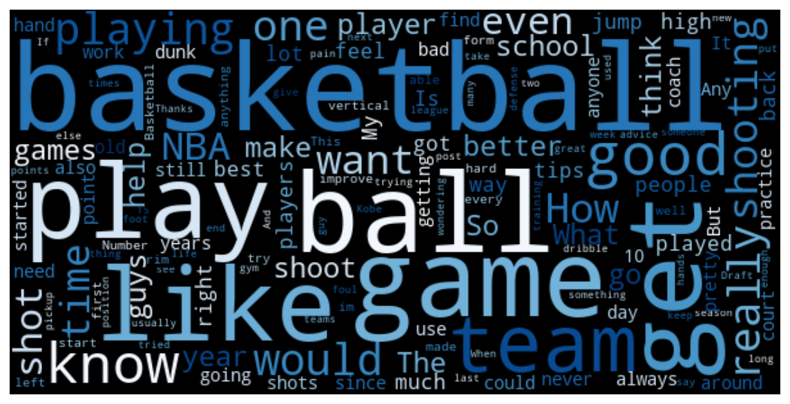
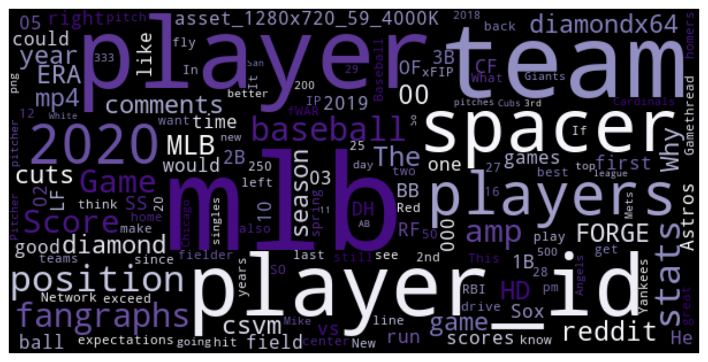
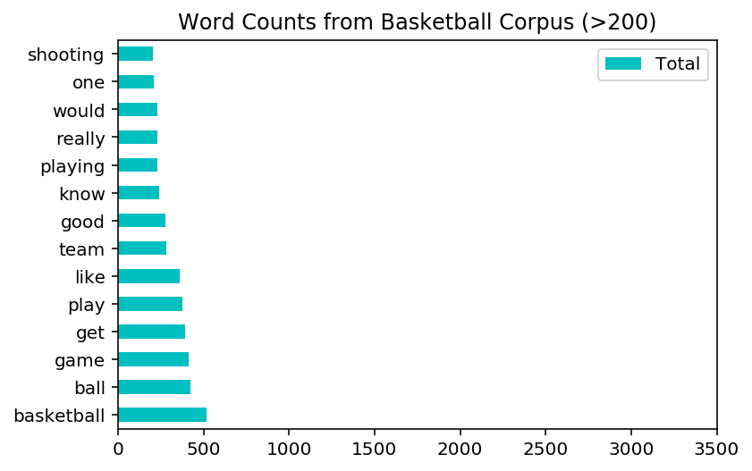
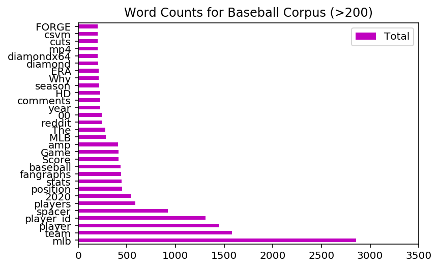
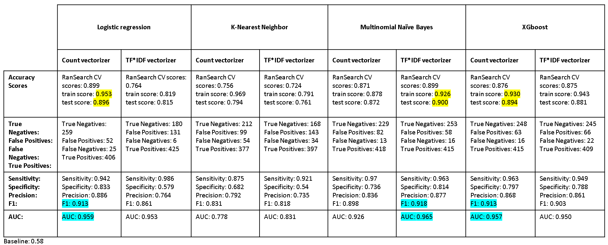
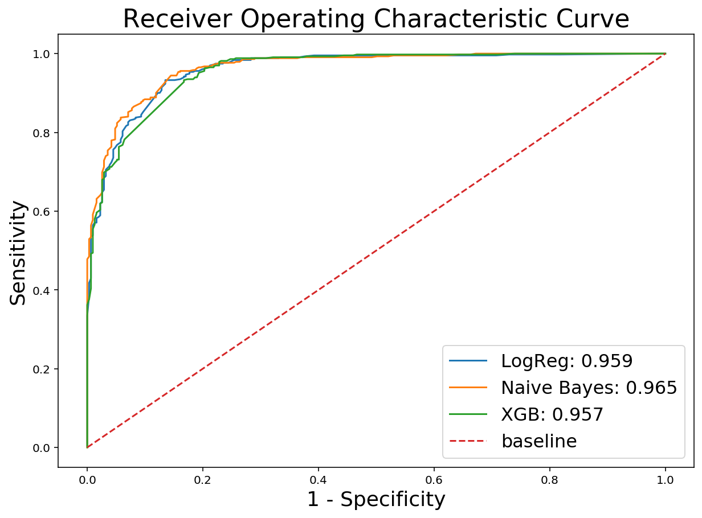
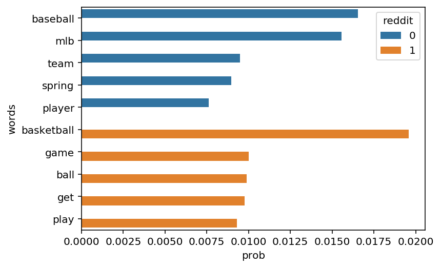
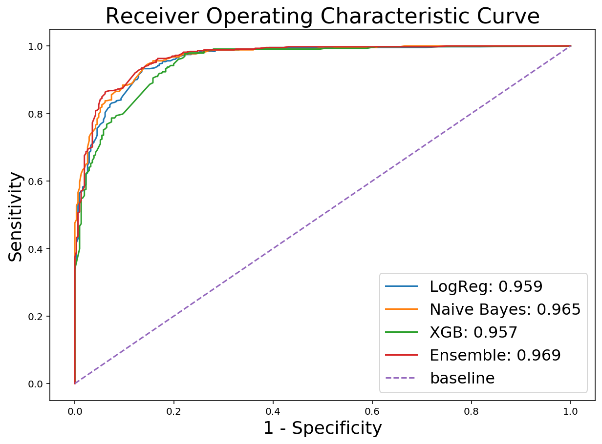

# Classification with Natual Language Processing

## Problem Statement (fictional): 
A virtual reality gaming company has engaged me to help with their advertisements and marketing via a popular social media platform for 2 games: Basketball and Baseball.

The firm is interested in a "per impressions scheme", which enables them to select a user's feed to post the advertisements on and pay by the number of impressions. As prices of advertisements are steep, they want their advertisements to reach out to the right target audience. 

**My goal** is to collect a wealth of text and process it with Natural Language Processing (NLP), and come up with a model that will predict, with high accuracy, which group an audience belongs to so that I can target advertisements(ads) that are specific to the audience. 

In other words, my model will classify if someone falls into these 2 category and targetted ads will be sent to that person via his social media feed. 

8 different models were tested. First, using countvectorizer then TFIDF vectorizer on a logistic regression. Then, using countvectorizer then TFIDF vectorizer on K-nearest neighbor. Then, using countvectorizer then TFIDF vectorizer on a Naive Bayes classifier. Finally, using countvectorizer then TFIDF vectorizer on a Gradiant Boosted classifier called XGBoost.

### Evaluating Success
1. the model needs to classify basketball and baseball post accurately. This will be evaluated across different classification metrics
2. the model should perform better than the baseline model 

## Executive Summary

I set out to build a Natural Language Processing model that would classify text from basketball and baseball fans, so as to target advertisments and marketing materials to them accordingly.

Data was optained from 2 subreddits, basketball and baseball. After cleaning and exploring the data, it was processed and modeled. 

6 different models were tested. First, using countvectorizer then TFIDF vectorizer on a logistic regression. Then, using countvectorizer then TFIDF vectorizer on K-nearest neighbor. Finally, using countvectorizer then TFIDF vectorizer on a Naive Bayes classifier. 

After a series of evaluation, the TFIDF vectorizer Multinomial Naive Bayes model emerge as my chosen model for the task. 

## GATHER DATA

### Exploring how a single page scrap from reddit looks

By looking at a single paged scrapped from a subreddit, we are able to identify that variables of interest will probably be the selftext and the title. The dependent variable will be the subreddit, to identify the source of the text.

### Import data 

I use two seperate notebook to scrap for basketball and baseball subreddits to speed things up after looking at how each json looks like. Below, i import them into the current notebook

## EDA & CLEANING 

EDA before splitting:

We should clearly understand the data before splitting. Clearly understanding the data helps in knowing which attributes to consider for building the model.

Another reason to do EDA before splitting is that we have explore the missing and outliers.

### Cleaning

Thus far, missing data and duplicates were removed. 
I also cleaned out the rule post in the basketball dataframe. 
The baseball dataframe had none. 
I searched if the post contains advertisements. I also removed post by the moderator.

I decided to combined selftext and title into a single column as our text as both are valuable text information. The total number of rows are summarized as follow:
- total basketball sample size: 1745
- total baseball sample size: 1244

The difference in sample size is about 29% and the whole set has 3690 samples. The subreddit has been renamed 'source' to identify where the data was from. The source is our dependent variable. 

I identify the X and y variable as per discussed, the text column is the X and y is the source, with basketball coded as 1. I defined additional stopwords which are mainly hyperlink components like www , https, .com. The text inside it might be useful and thus was retained (eg. hhtps://www.nba.com/supershot , "nba" and "supershot" may be useful discriminators. Note: the hyperlink example is made up for the purpose of illustration only)

### EDA

#### Words that stand out from the Basketball corpus

#### Words that stand out from the Baseball corpus

#### Words that stand out from the combined corpus 

We take a closer look at words that occure in the Basketball corpus and in the Baseball corpus and in both through a venn diagram that plots only words occuring more than 100 times.
Those in both corpus will not be discriminators while those in only one corpus may be good discriminators

We see that although there are more samples of basketball, the baseball corpus has more frequently repeated words above 200 counts. 

## PRE-MODELING 

### Seperate training set and put aside a test set
A train test split was perform. 

### Establish baseline score
With no additional information, the probability that we pick a basketball post amongst these two subreddits is 0.581. This will be used as our baseline accuracy score. 

## MODELING

I will be testing a total of 6 models. First, using countvectorizer then TFIDF vectorizer on a logistic regression. Then, using countvectorizer then TFIDF vectorizer on K-nearest neighbor. Finally, using countvectorizer then TFIDF vectorizer on a Naive Bayes classifier. 

While the countvectorizer simply counts the term's frequencies, the TFIDF vectorizer helps to account for words that appear mor frequently. The TFIDF is intended to reflect how important a word is to a document in a collection or corpus. The tf–idf value increases proportionally to the number of times a word appears in the document and is offset by the number of documents in the corpus that contain the word, which helps to adjust for the fact that some words appear more frequently in general. 

Because some terms are so common, term frequency will tend to incorrectly emphasize documents which happen to use thse word more frequently, without giving enough weight to the more meaningful terms that may appear less frequently. Terms that occur too frequently may not be good discriminators. For example, if a term occurs in every document of baseball and basketball (eg, maybe a word in the middle of our venn diagram), it simply isnt something that can help us differentiate anything. 

Hence an inverse document frequency factor is incorporated which diminishes the weight of terms that occur too frequently in the document set and increases the weight of terms that occur rarely.

A pipeline will be built at the start of each type of classifier. A Randomized Search CV will be used to find the best hyper-parameters out of those I defined. After which, i printed accuracy scores for the cross validation, the train and the test. I then calculated other classification metrics with the test set. 

## FINAL FITTED MODEL AND EVALUATION

All our models have performed far above the baseline model of 0.581. In terms of accruacry, the CountVectorizer with the Logistic regression and TFIDF vectorizer with the Multinomial Naive Bayes and TFIDF vectorizer with XGBoost performed the best in terms of accuracy on an unseen dataset.

In this mission, sending the ads to only the right audience is critical as failing to do so will cost the company money. Thus, true positives are important. On top of that we want to reduce any false positive. 

The above figure highlight the top 3 model. 

**The sensitivey** tells is how many of those that our classifier had classed as basketball are really from the basketball subreddit. **The specificity** tells us how many of those that our classifier classed as baseball are really baseball. **Finally, the precision** tells out of those that we identified as from the basketball subreddit, how many are really from the basketball subreddit. As you can see, all of which are important to us. Thus, we need a combination of these. 

We want to be sure that the person we send the add to are basketball fans (Precision) and we want to capture as many fans as can (sensitivity). Thus, a higher F1 score is desired. Under this score, the countvectorizer with Logistic Regression is our best model. The Naive Bayes outperformed the other models.

However, in real-world scenarios, there is always a tradeoff between sensitivity & specificity that we need to consider. When we look at the ROC curve, when 1-specificity is below 0.1 our naive bayes model is actually more sensitive. Between 1-specificity = 0.1 to 0.2, the logistic regression gives us the best sensitivity. After that, they both perform equally well.  Visually the XGBoost has a lower AUC score. When we calculate the area under curve, the Naive Bayes model performs best.

In our problem, the goal is not to perform particularly well on a specific class (basketball vs baseball). Rather, it has to balance between both classes. Thus, I choose to use the ROC-AUC as the metrics to evaluate and balance between true positives' rates(choosing basketball) and true negatives' rates(choosing baseball). The Native Bayes also has a low variance which is important as we want to generalize the model on unseen text data set in the social media platform. **Therefore, the model I will deploy is the TFIDF Multinomial Naive Bayes classifier.**

Top words predicting baseball are MLB(major baseball league), baseball, team, spring, player.
Top words predicting basketball are basketball, game, ball, get, play.

## CONCLUSION

Finally, using this model on unseen text data set in the social media platform, the model will identify if a particular user is a basketball or baseball fan and send advertisements and marketng materials to the user accurately.

This model is, however, not without limitations. Having only basketball and baseball documents does not mean that we can identify a baseball/basketball text from a non-baseball/non-basketball text well. To do so, future versions of this prototype model should include other random text and topics that are not baseball and baseketball. This is important as post on the social media platform are not exclusively basketball or baseball but contains other contents. 

## EXTRA 

Last but not least, this work has been improved on by using an ensemble model! Check out the codes in the note book. 