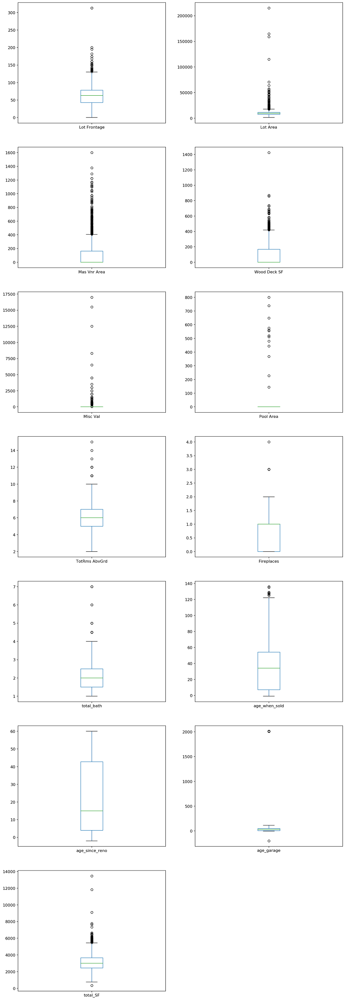
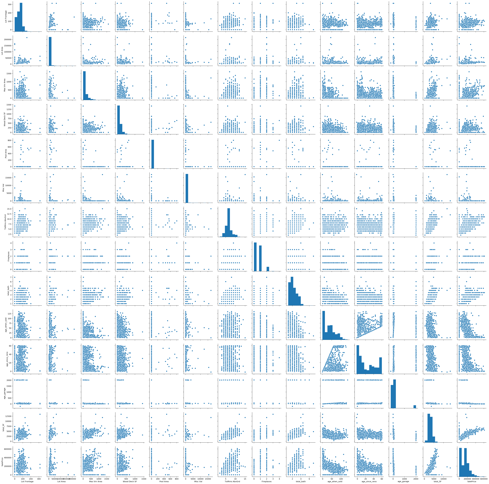
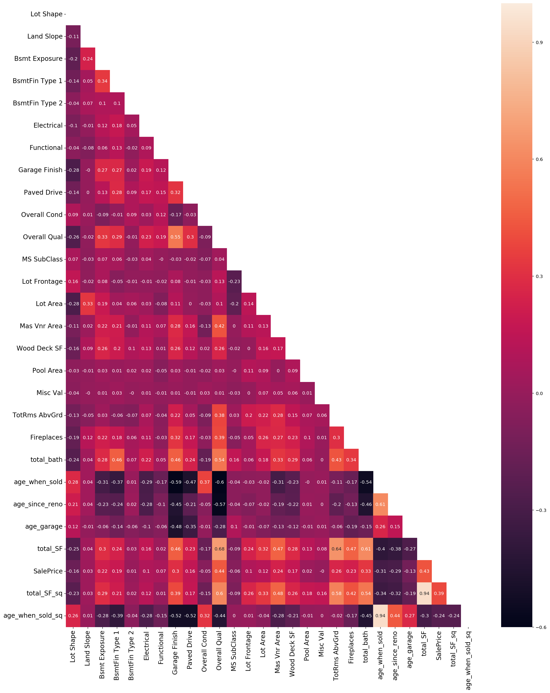
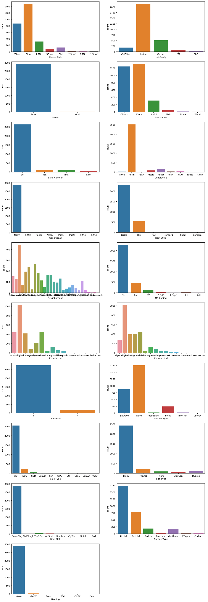
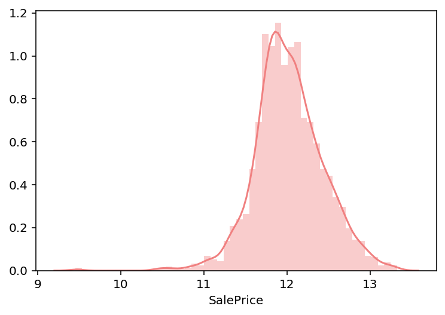
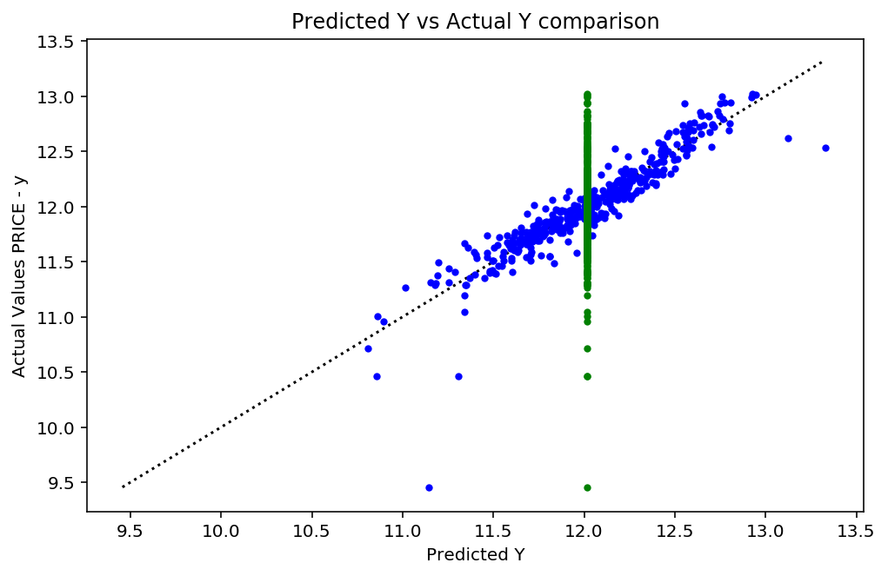
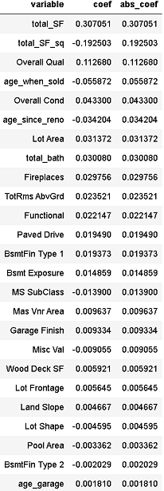
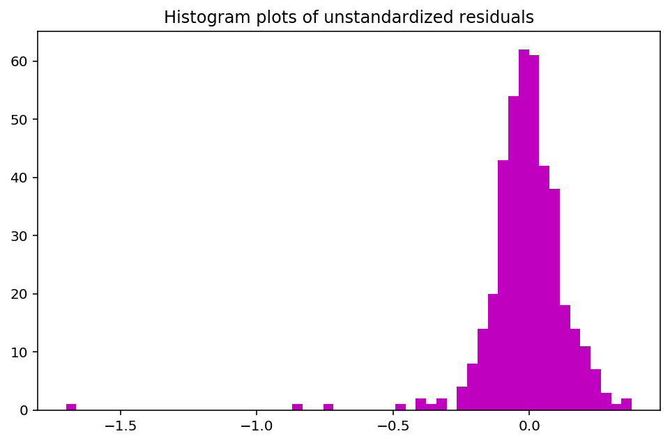
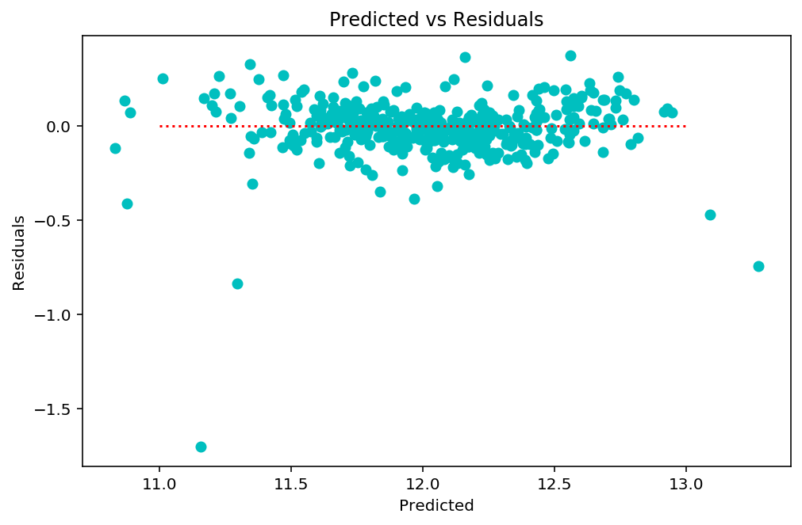
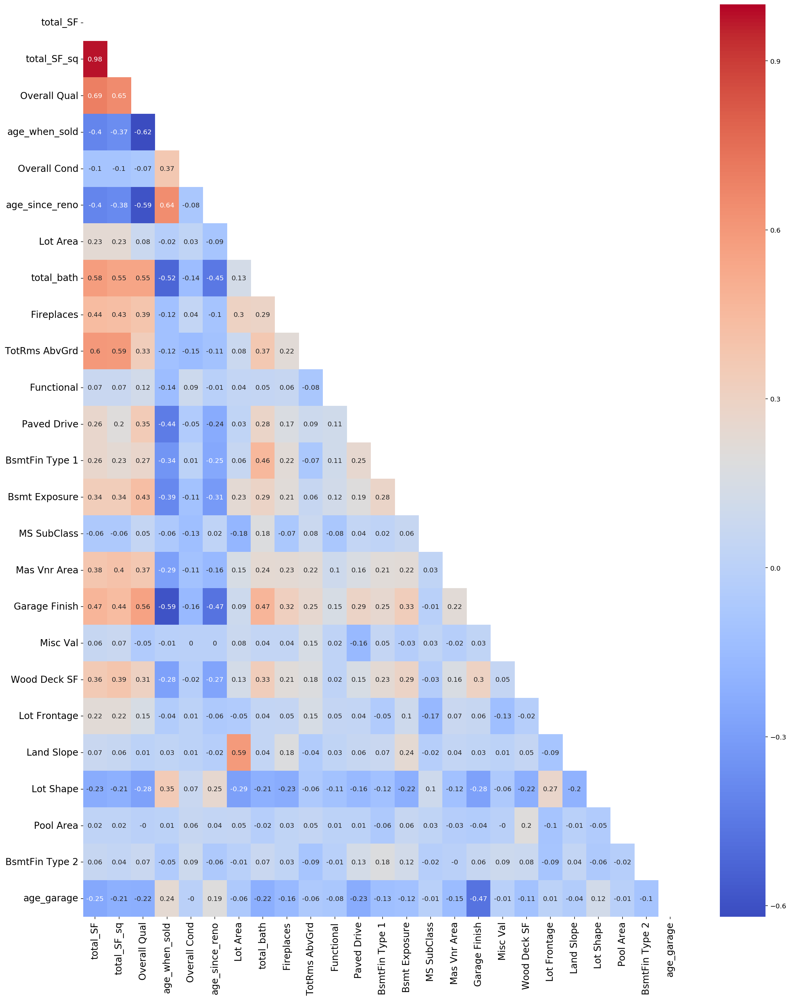

# Ames, Iowa Housing Sale Price Prediction
Dear Reader, 

Thank you for visiting my GitHub. This is my first ever project via Python! 
I hope you enjoy the read. Feel free to comment and share how I may improve on it in future. 

## Problem Statement
I am tasked with creating a regression model based on the Ames Iowa Housing Dataset. This model will predict the price of a house at sale.

My goal is to model a regression that would predict price of a house at sales accurately. The model should also be able to predict price of a house at sales accurately on an unseen set of predictor variables (generalizability).

Success will be evaluated by:
 - Our model should predict sale price better than a naive prediction of simply taking the mean of sale price. 
 - evaluating the train model against the test model using R2, MSE and RMSE.
 - evaluating the final model against the holdout set using RMSE.

For project is beneficial to the real estate agents, property buyers and sellers looking to put a price on a property in Ames. The project is also useful for designers and architects who seek to understand what features contribute to a higher sale price. 


## Executive Summary

The current study uses a multiple regression model to predict sale prices in Ames, Iowa. Data was cleaned and explored. I conducted a train test split and run a multiple linear regression and then regularize it with a Lasso regression to optimize our models performance and to achieve parsimony. The model was then evaluated to see how well it predicted sale price on the test sets. The model was then evaluated to see if the assumptions of regression would hold. I sum up the top 5 preditors of sale prices and discuss some practical implications of the model. Finally, limitations were discussed. 

### Contents:

- Data Cleaning and EDA
- Preprocessing
- Multiple regression
- Lasso regression
- Regression evaluation and diagnostics
- Discussion 
- Limitations

## Data Dictionary:

| Variable Name  | Type       | Description                                                         |
|----------------|------------|:--------------------------------------------------------------------|
| total_SF       | Continuous | Total square feet of house interior                                 |
| tota_SF_sq     | Continuous | Quadratic term of Total square feet                                 |
| Overall Qual   | Ordinal    | Rates the overall material and finish of the house                  |
| age_when_sold  | Discrete   | Age prior to sale                                                   |
| Overall Cond   | Ordinal    | Rates the overall condition of the house                            |
| age_since_reno | Discrete   | years from remodel to sale                                          |
| Lot Area       | Continuous | Lot size in square feet                                             |
| total_bath     | Discrete   | Total number of bathrooms                                           |
| Fireplaces     | Discrete   | Number of fireplaces                                                |
| TotRms AbvGrd  | Discrete   | Total rooms above ground, not including bathrooms                   |
| Functional     | Ordinal    | Home functionality (Assume typical unless deductions are warranted) |
| Paved Drive    | Ordinal    | Paved driveway                                                      |
| BsmtFin Type 1 | Ordinal    | Rating of basement finished area                                    |
| Bsmt Exposure  | Ordinal    | Refers to walkout or garden level walls                             |
| MS SubClass    | Ordinal    | Identifies the type of dwelling involved in the sale                |
| Mas Vnr Area   | Continuous | Masonry veneer area in square feet                                  |
| Garage Finish  | Ordinal    | Interior finish of the garage                                       |
| Misc Val       | Continuous | $Value of miscellaneous feature                                     |
| Wood Deck SF   | Continuous | Wood deck area in square feet                                       |
| Lot Frontage   | Continuous | Linear feet of street connected to property                         |
| Land Slope     | Ordinal    | Slope of property                                                   |
| Lot Shape      | Ordinal    | General shape of property                                           |
| Pool Area      | Continuous | Pool area in square feet                                            |
| BsmtFin Type 2 | Continuous | Basement finished area (if multiple types) in square feet           |
| age_garage     | Discrete   | Age of garage prior to sale                                         |


## Data Cleaning and EDA

### Two datasets provided
The data sets contains information from the Ames Assessor’s Office used in computing assessed values for individual residential properties sold in Ames, IA from 2006 to 2010.

- Training set: the dataset we will be using to develop, train and test our model.

- Holdout set: a dataset of predictors without sale price. Using our model, we will come out with sale price prediction. Kaggle, who knows the answers to the sale prices corresponding to this data set will then give a score based on how well our the predicts sale price.
    
The datasets were concatenated so that handling of missing data and coding of variables will be the same between the 2 sets. A column is create to identify the origin of the observations. The datasets have a total of 81 columns. The train.csv has 2051 rows and the test.csv has 879 rows of data. 

### Missing data
Missing values were counted next. "Misc Feature", "Alley", "Fence", 'Pool QC' were dropped as they had more than 80% missing. 

After looking at what these variable mean. All of this missing values are features of a house. These are features that not all houses may have. For example, some houses may not have a pool or a frontage or mansory or garages. 

For variables such as Bsmt Unf SF, those without a basement will have left these type of variables blank. There is strong support for this. 
I check the missing data of variables of interest with a cousin variables. For instance, if they do not have a garage, they should not have garage area, or garage finish. In another example, if they do not have any fireplaces, they should not have any fireplace quality as it doesnt exist to begin with. I found further support that this data are not actually missing data but are a response "Na" in a survey to indicate that the house does not have such a feature. Through deduction, imputing a value to indicate that they do not have such a feature would make the most sense. For non-numerical variables, I imputed "donthave" and for numerical variables, I imputed 0. 

### Exploring the meaning of variables deeper 
We can see that many variables are actually very similar to each other or may are a repeat of each other. For example, if we take the sum of BsmtFin SF 1, BsmtFin SF 2, Bsmt Unf SF, we would get the same number as Total Bsmt SF. Similarly, in the ordinal variable example Exter Cond,Bsmt Cond,Garage Cond, Overall Cond are all closely related and we can just take Overall Cond to represent condition. This type of repeats are redundent and may would cause multicolinearity amongst variables. This variables will be combined and the dropped accordingly. Below sums up the actions taken to reduce such variables.


| Similar/Related Variables | Action taken |
| :--: | :-----------: |
|BsmtFin SF 1<br>BsmtFin SF 2<br>Bsmt Unf SF<br>Total Bsmt SF<br>1st Flr SF<br>2nd Flr SF<br>Low Qual Fin SF<br>Gr Liv Area<br>Open Porch SF<br>Enclosed Porch<br>3-Ssn Porch<br>Screen Porch<br>garage cars<br>garage area<br>|sum totals for each type<br> get new variable called total sf|
|Bsmt Full Bath<br>Half Bath<br>Full Bath<br>Bsmt Half Bath|create Total bath by summing all<br>1 for full bathrooms and 0.5 for half bathrooms.|
|Kitchen AbvGr<br>Bedroom AbvGr<br>TotRms AbvGrd|drop all but TotRms AbvGrd|
|Exter Qual<br>Bsmt Qual<br>Kitchen Qual<br>Heating QC<br>Garage Qual<br>Fireplace Qu<br>Pool QC<br>Overall Qual|drop all but Overall Qual|
|Exter Cond<br>Bsmt Cond<br>Garage Cond<br>Overall Cond|drop all but Overall Cond|
|Yr Sold<br>Year Built<br>Mo Sold|age_when_sold = Yr Sold - Year Built<br>Mo Sold dropped|
|Yr Sold<br>Year Remod/Add|age_since_reno = Yr Sold - Year Remod/Add |
|Garage Yr Blt<br>|Garage_age = Yr Sold - Garage Yr Blt|


#### Exploring the dataset
The exploratory data analysis will be divided into smaller sections for easy reading purposes. It will be divided by the measurement datatypes. I define the types below, to guide readers. 

**Datatypes:** 

- **Ordinal:** Variables with an ordered series. Although ordinal data are distinctive categorical groups, it increase in magnitude. This research, like many, infers quantity from order and treats it as a quantitative variable. For example, in this dataset, Land slope can be measured by degree of allevation. However, the data was collected such that it only reports a gentle, moderate and severe slope. This are increasing order of allevation and can be treated as continuous. 
    
- **Discrete/Continuous:** Discrete variables are based on counts (eg. Garage Cars) and continuous data are those that can be measured on a continuum (eg. Lot Area). Both will be refered to as continuous in this analysis.

- **Norminal/binary:** Variables with no inherent order or ranking sequece. In this research, categorical variables are used as a term to refer to these variables as well, even though, the true meaning of categorical data would inlude ordinal data. This research infers quantity from order and treats it as a quantitative variable. For example, Paved vs Gravel street. 


#### Exploring Continuous, Ordinal variables 
There is a total of 28 Continuous, Discrete, Ordinal variables.

**Ordinal** data was identified. Value counts were conducted on them and Utilities was dropped as it had only 2 and 1 responses for NoSewr and NoSewa. After that, ordinal variables were coded  larger number represents more of a desired quality. Example, Lot Shape was coded from 1 to 4 with 1 being the most irregular and 4 being regular. Variables that contain responses indicating an absence of a feature will have 0 coded for absence. After coding them, i made sure they were integers or floats. 

**Continuous** Boxplots were plotted on continuous variables. Visually, Lot frontage, lot area, totrms abvgrd, total SF seem to be normally distributed with many outliers. The other variables are skewed. Pool area and Misc Val have medians at 0. 

<details><summary>Drop down for plots</summary>


</details>

**Outliers** are identified in continuous variables. There are quite a lot outliers in this dataset, based on the 3SD rule of thumb. However, it might possible that there are super big houses and houses that are very small. In a normal distribution, about 99.7% should be in within the +/- 3SD range. However, we cannot simply remove them as it is possible that the disparity between huge houses and average size houses is large. The range of outliers a variable have ranges from as little as 6 in age_when_sold to 159 in age_garage.

**Pairplots of the continuous, discrete and ordinal variables and the dependent variable (DV), SalePrice, was plotted.** Pairplots seem to show TotRms AbvGrd, Garage area, Gr liv area as possible normal distributions. The other variables are highly skewed or discrete. SalePrice (DV, dependent variable) is positively skewed. I will log transform the DV to make DV more normally distributed in later parts of the analysis. We see some variables correlating with each other but not strongly. The IV's seem to fit a linear combination of the DV except total_SF, age_when_sold.

Total_SF, age_when_sold seem to have a quadratic function to the DV. Thus, I included quadratic terms for them. 

<details><summary>Drop down for plots</summary>


</details>

**Correlations** Heatmap was plotted for continuous, discrete and ordinal variables. Overall, there are some variables correlaing strongly with each other such as Garage finish and age_when_sold. There are also variables that have zero correlations with each other when rounded to 2 decimal places such as Misc Val and Lot frontage. At a glance, it doesnt seem like there are stong correlations to the DV. No IVs seem to correlate more than a magnitude of 0.5 with the DV. 

<details><summary>Drop down for plots</summary>


</details>

### Exploring Norminal/Binary variables 
There is a total of 16 norminal and binary variables. 

**Histograms of counts were plotted for norminal and binary variables.** At an instance, we can see some features/category within the variables are more popular than others. For instance, in House Style, 1story is the most popular. Some of the variables have very few counts in their respective categories. For instance, Street which have 2043 Pave but only 7 in Grvl. This renders the variable useless as the disparity between categories are too large. Some features such as mansory is very rare and have a lot more people who do not have it than have it will also be dropped. These variables are dropped: Street, Condition 2, Roof Matl.

<details><summary>Drop down for plots</summary>


</details>

**Dummy coding** The remaining variables were dummy coded, dropping the first of each. This means that a 0 for all the dummy coded variable of a variable will represent the column that has been dropped. Thus, each variable has n-1 columns of dummy coded variables, where n is the number of unique responses for that variables. This is the number of values that are free to vary (degree of freedom) for each variable. The parent variable was dropped from the dataset while the dummy coded variables were added in. 


## Preprocessing
Using the identifier, we **split the data back to its original source** (training and holdout set). The **DV is now log transformed** to give it a more normal distribution to correct for its positve skew. This will not affect the test set as the test set does not have any DV provided. A **train-test split** was performed on the training data. 80% of the data was splitted for training while 20% was reserved for testing the model developed. 

<details><summary>Drop down for plots</summary>


</details>

## Multiple regression
The train set was fitted into a linear regression and a R2 score of 0.899 was obtain. This means that our model was able to explain 89.9% of the variance in sale price, within the training set. When the fitted model was used to score the test set, it yeild an R2 of 0.869, a drop of about 0.03. A 10 fold Cross validation was performed with a mean R2 score of 0.883. The cross validation's mean of root mean square value (RMSE) 37,991.26. Compared to a baseline model with a MSE of 0.1802 and a RMSE of 0.4245, calculated by the mean of sale price, this is a stark improvement in prediction scores as it reflect that our model predicted sale price is closer to the test set's sale price. 

The bias of this model is very low with a relatively moderate variance. However, due to the large amount of variables, there is still a risk of overfitting. We want to perform a type of regularization where the data values to reduce multicolinearity and more importantly, overfitting. This works by increase the sum of square errors, much like introducing some "bias" into the model so that it performs better in a real prediction.  

Actual prices of the test set was plotted against its predicted. The scatter plots show that the predicted and actual sale price is highly accurate as it follows closely on a 45 degree diagonal line with minimal noise. 
<details><summary>Drop down for plots</summary>


</details>


## Lasso regularization

**Lasso regression was the selected choice** to regularize the model due to its unique shrinkage. The procedure encoourages parsimony. It also helps to automate certain parts of model selection by applying a penalty. This more streamlined, more parsimonious model will likely perform better at predictions and will be better understood/interpretted by audience. It adds a penalty that is equal to the absolute value of the magnitude of the coefficients. As such, some coefficients may be eliminated which help us fulfil our goal of a parsimonious model. 

Prior to the Lasso regressions, **scaling of IVs** was performed. The training set was scaled by minusing its mean and dividing by its standard deviation to being it into a Z scale. The same scaling that was fitted into the training IVs was used on the testing IVs.

An **optimal alpha** was selected by 555 number of aphas along the regularization path from a list ranging 0.001 to 0.15. The optimal alpha of 0.001 was obtained and fitted into the Lasso regression with the training set. 

**Scores** for the training and test was calculated. The R2 score was 0.898 and 0.870 respectively. A 10 fold cross validation was performed, yeilding an R2 score of 0.883. The cross validation's mean of root mean square value (RMSE) 38,512.90. This is higher as Lasso introduces some bias that to the sum of squared errors that is equals to multiplication of alpha and the absolute slope of the regression line to reduce variance and overfitting. The high R2 scores tell us that our model is very low in bias. The difference in R2 scores between training to test and between training to crossvalidation scores tell us that our model have a fairly low variance and would likely generalize well on an unseen set of predictors. 

Compared to a baseline model with a RMSE of 78512.42, calculated by the mean of sale price, this is a stark improvement in prediction scores as it reflect that our model predicted sale price is closer to the test set's sale price.The Lasso regression scored slightly better than the multiple regression without regularization. However, the number of variables left was 25 from 153 previously, which shows that our final fitted model is five times more parsimonuous. 





**Comparison of model's accuracy scores**

|Baseline Model| test  |
|:-----------:|-------------|
|    MSE    |    6,164,201,301.63  |
|    RMSE   |    78,512.42   |

|     MR:   |    Train    |    Test    |    CV    |
|-----------|-------------|------------|----------|
| R2 scores | 0.899       | 0.869      | 0.883    |
|    MSE    | 636,032,987.90 | 882,939,532.29     | 1,443,336,301.90  |
|    RMSE   | 25,219.69   | 29,714.29     | 37,991.26   |

|   Lasso:  |    Train    |    Test    |    CV    |
|-----------|-------------|------------|----------|
| R2 scores | 0.898       | 0.870      | 0.883    |
|    MSE    |    644,415,247.77   | 819,560,631.94  | 1,483,243,765.82   |
|    RMSE    |    25,385.33   | 28,627.96     | 38,512.90   |

## Regression evaluation and diagnostics

Actual prices of the test set was plotted against its predicted. The scatter plots show that the predicted and actual sale price is highly accurate as it follows closely on a 45 degree diagonal line with minimal noise. The plots look exactly the same as before the Lasso regression, as expected from only a minimal increase in scores from the multiple regression and the Lasso regression. However, the Lasso model was used as it has significantly reduced the number of variables, allowing us a simplier model. 

<details><summary>Drop down for plots</summary>


</details>

**Normally distributed errors assumption** hold from QQ plots and histogram plots of unstandardized residuals. However, from pairplots during the EDA phase, we can see not all IVs are normally distributed. 

<details><summary>Drop down for plots</summary>
    

</details>

**Linearity** is assume to hold from pairplots during the EDA as visual inspection show variables are a linear combination. Quadratic terms for those which were did not look linear (total_SF, age_when_sold) were included in the analysis. 


**Independence of error** are inspected from the 'Predicted vs Residuals' plots. Ias error variance don't look like it fan in or out when we plot Predicted vs Residuals!


**Constant error variance** is assume to hold as they are a consistent pattern regarless of the value of X. 

<details><summary>Drop down for plots</summary>
    

</details>
 
**Multicolinearity** has been inspected through the heatmap plotted. As most continuous and ordinal variables are not highly correlated (r = 0.5) with each other, this assumption is assume to hold. Furthermore, the Lasso regression would reduce multicolinearity further. 

<details><summary>Drop down for plots</summary>
    

</details>

The next step is to fit the holdout set into this model and predict its scores.  


The kaggle score obtain by this model is 31603.66015 which is within the Top 50 for that particular competition. 


## Discussion  

The top 5 predictors of sale price for a property in Ames is:
- Total_sf
- Overall Qual
- age_when_sold
- Overall Cond
- age_since_reno

**Interpretation**

With every feature held constant, the sale price of a property is about 167,081.54. 

One unit increase in Total SF increase the sale price by 0.307 when all else are held constant. There is a diminishing returns of 0.192 of sale price for every other unit increase in Total SF. That is, total SF's effect on sale prices decreases on level's of itself.

One unit increase in Overall Qual increases the sale price by 0.113. One unit increase in Overall Cond increases the sale price by 0.043. These makes sense as these are desirable traits. 

Each unit increase in age_when_sold increases the price by decreases sale price by 0.056. This might be because buyers prefer new properties to older ones. Similarly, every unit increase in age since renovation would decrease sale price by 0.034 as buyers may prefer properties that are more newly renovated. 

**Implications**

These findings have important practical implications. For anyone interested in sale prices of property such as property buyers, real estate firms, those looking to sell their property or even designers, the top 5 factors to consider that will increase the sale price of the property are total square feets, overall quality, age when sold, overall condition and age since renovation. 

Home designers, architects and developers may think about how to maximize total square feets. For instance, for a fixed plot of land, adding a basement and an additional level to the house can greatly increase total square feet, which associates to a higher sale price. Buyers, agents and investors may consider the total square feet when deciding on property to invest as well. 

When designing a house or building one, architects, designers and developers want to consider the quality of their build as it would likely associate with a higher sale price. In general, qualtity gives assurance to buyers and investors which leads to its high association with sale price despite the age. Conversely, low quality builds may hurt sale prices and deter buyers. 

Overall condition is especially important for homeowners. At times, maintaining a properties condition requires time and cost. Through this analysis, it seems that these efforts will pay off with a better sale price. Renovations also seem to be valued and associated with a higher sale price, especially the more recent the renovation was done. The reverse is true that a property in bad condition would hurt sale prices. This is likely linked to the fact that it improves the overall conditions. 

Contuary to what the market believe, neighborhood was not a significant predictor of sale price in Ames. This is perhaps due to the facr that Ames real estate is already some of the most expensive in Iowa, although Ames house values don't compare to the most expensive real estate in the USA. Furthermore, Ames is a decidedly white-collar city, with fully 88.03% of the workforce employed in white-collar jobs, well above the national average. Overall, Ames is a city of professionals, sales and office workers, and service providers. There are especially a lot of people living in Ames who work in teaching (17.25%), office and administrative support (11.91%), and food service (8.57%). Having this may mean that most neighborhoods in Ames are already well developed and roughly equal (https://www.neighborhoodscout.com/ia/ames).


## Limitations
This analysis is not without limitations. Firstly, outliers and extreme scores were many. These outleirs may have influeced the results of the analysis. In balancing between accuracy of predictions for the average property with the accurary of prediction for Ames as a whole, I have picked the latter at a cost of the former. By removing outliers and extreme scores, we would greatly improve our predictions on the average property in Ames. Research to follow may look into calculating how much leverage this points may have on the predictions and choose to develop a model that better fit the average of the population. 
 
Secondly, from pairplots during the EDA phase, we can see not all IVs are normally distributed. Apart from collecting more data, research to follow may consider transforming IVs so that they would have a more gaussian like distribution. 

It also seem like some of out variables may have potential interaction effects. Specifically, it seems that overall quality and age when sold may interact with each other to predict sale prices. Overall condition and age when renovation may also interact with each other. 

Lastly, the data is only from five years and the data was from 2006 to 2010 which is a decade ago. Prices and variables and the economy of Ames might have changed over 10 years.

Finally, this model is by no means generalizable to any state in the USA as the model has only been fed and trained by data colleted in Ames. In order to be able to generalize across other states, random samples from each state would be prefered. 


### Points for improvement
- Better visualizations
- Consider how to handle outliers better. 
- Consider exploring those with 80% missing before dropping as there may be some patterns i missed out
- Consider doing more qualitative research 
- Consider interactions 
- Consider not dropping so many variables since lasso automates feature selection to some extent


```python

```
